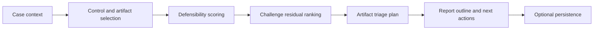
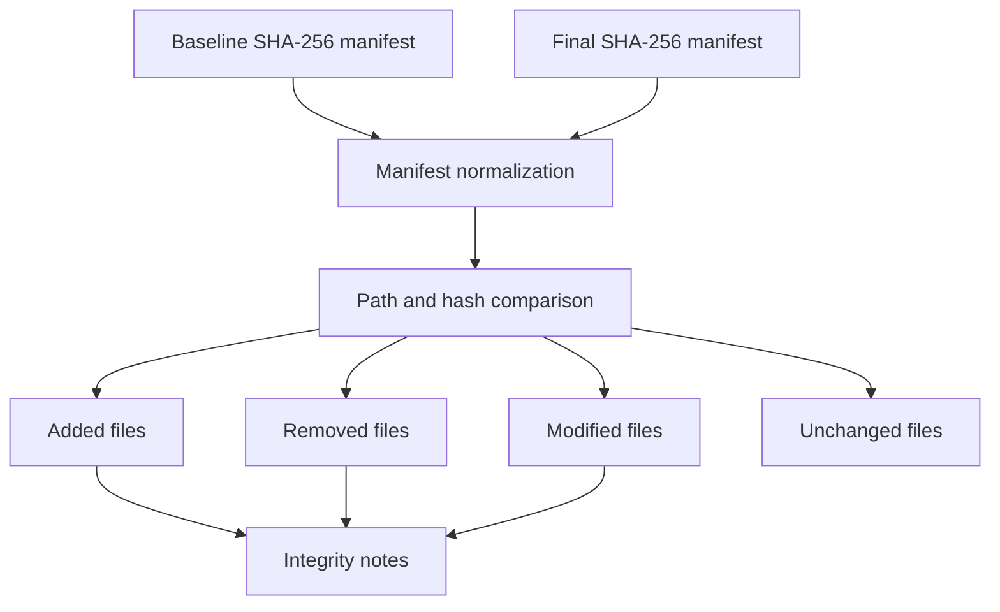

# Architecture

The platform translates the Zenbo robot forensics case study into a structured casework system.

## Layers

1. Web interface

   `public/index.php` provides the dashboard, casework assessment, artifact catalog, hash differencing, paper alignment, health, and JSON routes.

2. Service layer

   `src/Service/ForensicsService.php` calculates defensibility, ranks forensic challenges, prioritizes artifact sources, produces a report outline, and compares SHA-256 manifests.

3. Repository layer

   `src/Repository/LabRepository.php` exposes catalog data and persists case assessments when MySQL is configured.

4. Research catalog

   `config/paper.php` contains paper metadata, workflow stages, artifact sources, forensic challenges, controls, and report dimensions.

5. Persistence

   MySQL stores seeded research data, case assessments, hash-diff runs, chain-of-custody events, and audit records.

## Flow

## Hash-Diff Flow

## Extension Points

- Add new robot families in `config/paper.php`.
- Add parser-specific modules under `src/Service`.
- Extend `hash_diff_runs` with examiner notes and evidence references.
- Add authentication before assessment history is exposed.
- Add export templates for court, executive, or lab reporting.

